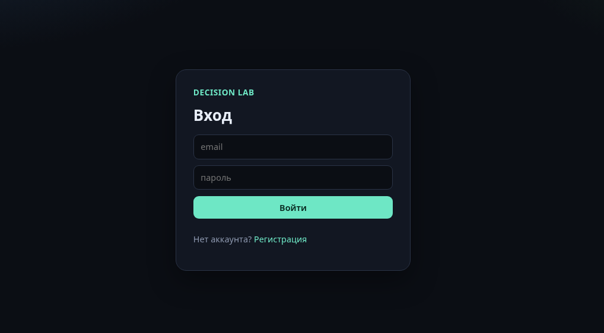
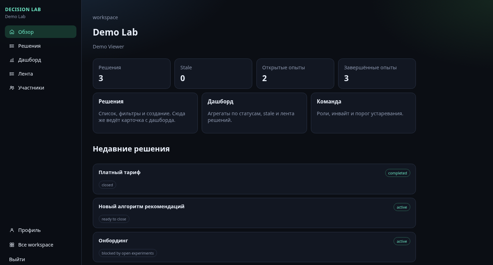
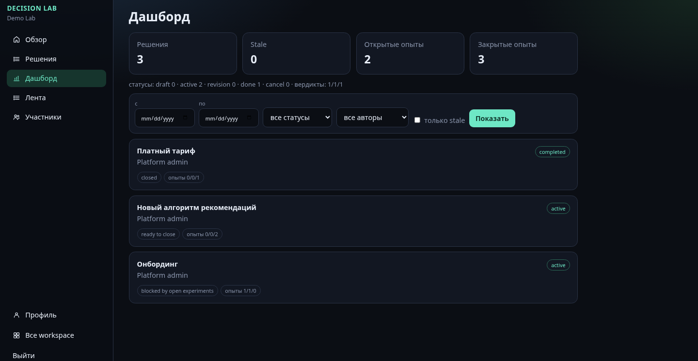
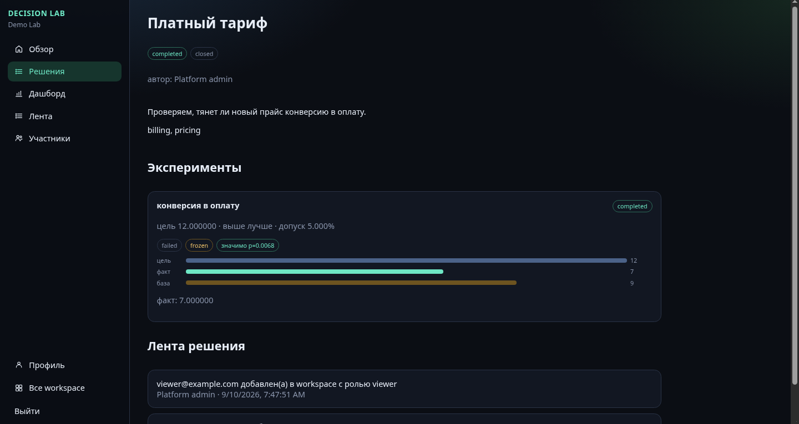
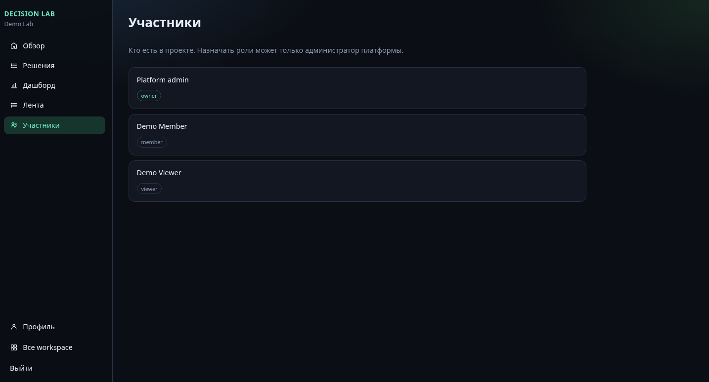

# Decision Lab

Командная лаборатория решений и экспериментов: workspace, роли, вердикт по метрике считает сервер.

## Запуск

```bash
docker compose up --build
docker compose exec backend alembic upgrade head
docker compose exec backend python -m app.seed
```

Фронт: http://localhost:3000  
API: http://localhost:8001 (если в compose так проброшен бэк).

Админ из `backend/config_admin.yaml` (по умолчанию `admin@example.com` / `changeme-admin`).  
После seed: `member@example.com` и `viewer@example.com`, пароль `demo-pass-12`.  
Другой почтовый домен: `SEED_EMAIL_DOMAIN` в `.env`.

Создавать workspace может только админ из конфига. Обычный аккаунт после регистрации видит пустой список, пока его не добавят в «Люди».

## Что смотреть после seed

Одна комната **Demo Lab**:

- Онбординг — active, открытые опыты  
- Новый алгоритм рекомендаций — success и partial  
- Платный тариф — completed, failed  

Viewer только читает. Member пишет решения и опыты. Удалять опыт и рулить комнатой — owner.

## Скриншоты






